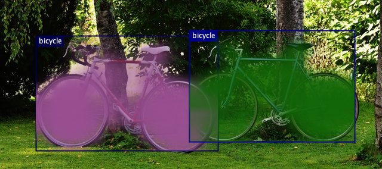

# Instance segmentation example

Instance segmentation refers to the task of detecting objects of various classes and individual instances of objects in each class at per pixel level. Instance segmentation combines semantic segmentation and object detection.

In this example, you learn how to implement inference code with Deep Java Library (DJL) to segment classes at instance level in an image.

The following is the instance segmentation example source code:

[InstanceSegmentation.java](../src/main/java/ai/djl/examples/inference/InstanceSegmentation.java).


## Setup Guide

Follow [setup](../../docs/development/setup.md) to configure your development environment.

## Run instance segmentation example

### Input image file
You can find the image used in this example in project test resource folder: `src/test/resources/segmentation.jpg`


### Build the project and run

```
cd examples
./gradlew run -Dmain=ai.djl.examples.inference.InstanceSegmentation
```

This should produce the following output

```text
[INFO ] - Segmentation result image has been saved in: build/output/instances.png
[INFO ] - [
	class: "bicycle", probability: 0.99887, bounds: [x=0.095, y=0.214, width=0.477, height=0.683]
	class: "bicycle", probability: 0.97689, bounds: [x=0.495, y=0.183, width=0.434, height=0.662]
]
```


With the previous command, an output image with bounding box around all objects will be saved at: build/output/instances.jpg:


