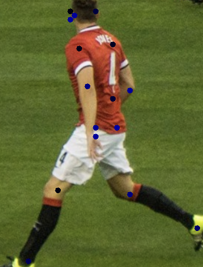

# Pose estimation example

Pose estimation is a computer vision technique for determining the pose of an object in an image.

In this example, you learn how to implement inference code with a [ModelZoo model](../../docs/model-zoo.md) to detect dogs in an image.

The source code can be found at [PoseEstimation.java](../src/main/java/ai/djl/examples/inference/PoseEstimation.java).

## Setup Guide

Follow [setup](../../docs/development/setup.md) to configure your development environment.

## Run pose estimation example

### Input image file
You can find the image used in this example in the project test resource folder: `src/test/resources/pose_soccer.jpg`


### Build the project and run
Use the following command to run the project:
```
cd examples
./gradlew run -Dmain=ai.djl.examples.inference.PoseEstimation
```

Your output should look like the following:
```text
[INFO ] - Pose image has been saved in: build/output/joints.png
[INFO ] - 
[       Joint [x=0.333, y=0.063], confidence: 0.6940,
        Joint [x=0.333, y=0.031], confidence: 0.7182,
        Joint [x=0.354, y=0.047], confidence: 0.4949,
        Joint [x=0.354, y=0.047], confidence: 0.9011,
        Joint [x=0.458, y=0.031], confidence: 0.8790,
        Joint [x=0.375, y=0.172], confidence: 0.8546,
        Joint [x=0.542, y=0.156], confidence: 0.8659,
        Joint [x=0.417, y=0.313], confidence: 0.7731,
        Joint [x=0.625, y=0.328], confidence: 0.9211,
        Joint [x=0.458, y=0.500], confidence: 0.7541,
        Joint [x=0.542, y=0.359], confidence: 0.5837,
        Joint [x=0.458, y=0.469], confidence: 0.6387,
        Joint [x=0.563, y=0.469], confidence: 0.6686,
        Joint [x=0.271, y=0.703], confidence: 0.8583,
        Joint [x=0.625, y=0.719], confidence: 0.8233,
        Joint [x=0.125, y=0.969], confidence: 0.7007,
        Joint [x=0.958, y=0.844], confidence: 0.7480
]
```

An output image with the detected joints will be saved as build/output/joints.png:


